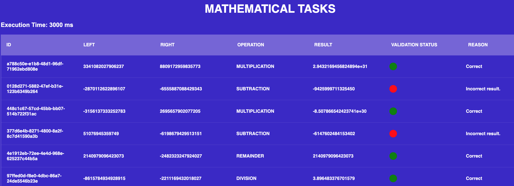

## Task Calculator

This service requests arithmetic tasks from an API, calculates and validates them, and adds them to a dashboard.

## Run
```
npm install
npm run start
```

The dashboard can be accessed at:
```
localhost:3000/dashboard
```

The dashboard updates every 5 seconds.

## Job
When the application starts, a background job runs to request tasks, solve them, and validate the results.

The interval for task requests is displayed at the top of the dashboard.

#### Execution Time: 1000 ms

A log is generated when a task is executed:
```
Task executed at 4:45:44 PM
```

## To Many Request scenario
If the HTTP status response is 429 (Too Many Requests), the background task adjusts with increased time between calls.

A log informs about this adjustment:
```
adding delay, from 1000ms to 2000ms
```

## Errors
For undesired HTTP status responses, error logs are created:
```
'Error status:' 400
```
```
'Error data:' Incorrect.
```


## Configurations
The .env file contains the following configurations:

* PORT: port of the application
* POOLING_MILLISECONDS: time between api calls
* TO_MANY_REQ_DELAY: delay to be added in cases of 429 http status
* TASK_URL: external api url


## Future Improvements
* ESLint could be configured more rigorously.
* Enhanced testing is necessary.
* Ensure adherence to common JS/TS patterns.
* Dashboard update time should be externilized or configurable by api.
* Task requisition time should externalized or configurable via API.
* An API to mess with the calculator and create exemples of erros.

#### If you are unable to control the API and want to simulate dashboard errors within this application:
- in *src/services/math_service.ts::44*, you can find the calculator. Mess with some calculations, and the system will generate erros.
- in *src/adapters/task_adapter.ts::32*, you will find the logic that enhances the polling time in case of a ToManyRequests error. Change to BadRequest and you will observe the system's behavior to diminish the number of request.


